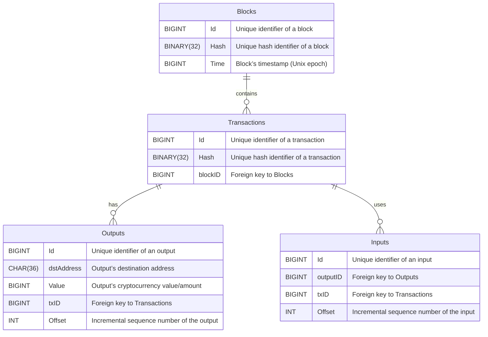

# Blockchain Data Model

As a data scientist exploring blockchain, it's crucial to understand its fundamental data model. The blockchain data model forms the backbone of its security. Let's dive into the specifics of this model.

## Core Components of the Blockchain Data Model

### Blocks
- **Purpose**: Serve as the primary storage units in a blockchain.
- **Key Elements**:
  - `Id`: A unique identifier (BIGINT) for each block.
  - `Hash`: A unique cryptographic hash (BINARY(32)) for each block.
  - `Time`: Timestamp (BIGINT) indicating when the block was created.

### Transactions
- **Purpose**: Record all individual transactions within a block.
- **Key Elements**:
  - `Id`: Unique identifier (BIGINT) for each transaction.
  - `Hash`: Unique cryptographic hash (BINARY(32)) for each transaction.
  - `blockID`: Foreign key (BIGINT) linking the transaction to its block.

### Outputs
- **Purpose**: Represent the outcomes of transactions, like cryptocurrency transfers.
- **Key Elements**:
  - `Id`: Unique identifier (BIGINT) for each output.
  - `dstAddress`: Destination address (CHAR(36)) for the output.
  - `Value`: Cryptocurrency value/amount (BIGINT) transferred.
  - `txID`: Foreign key (BIGINT) linking the output to its transaction.
  - `Offset`: Sequence number (INT) of the output in the transaction.

### Inputs
- **Purpose**: Specify the sources for the funds in transactions.
- **Key Elements**:
  - `Id`: Unique identifier (BIGINT) for each input.
  - `outputID`: Foreign key (BIGINT) referencing the previous output used in the transaction.
  - `txID`: Foreign key (BIGINT) linking the input to its transaction.
  - `Offset`: Sequence number (INT) of the input in the transaction.

## Relational Model

In this relational model, `Blocks` serve as the fundamental entities containing `Transactions`, which in turn consist of `Inputs` and `Outputs`. 

